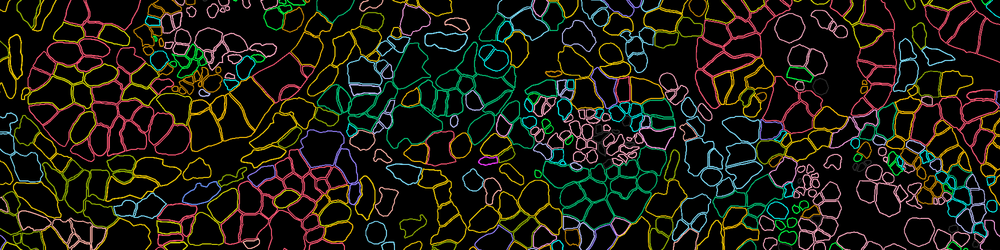

# Analysis of Spatial Transcriptomics Data (Xenium)

Welcome to our **hands-on workbook collection** to learn spatial transcriptomics data analysis, with a focus on 10x Genomics Xenium data!

Spatial transcriptomics allows us to measure gene expression across tissue sections while preserving spatial information, helping us understand not just **which** genes are active, but also **where** they are active.

With our workbooks, you will explore how to analyze spatial transcriptomics data using **R** and **RStudio**. Whether you're new to spatial data or already familiar with single-cell workflows, our guides will walk you through the essential steps.

**Table of contents**

- [Workbooks overview](#workbooks-overview-)
- [Credits](#credits-)
- [Contributions](#contributions-)
- [Citation](#citation)
- [Quick Start](#quick-start-)

## Workbooks overview

Our workbooks cover:

- Learn how to [load spatial data into R](workbooks/read_dataset_to_seurat.qmd) and examine how the data is structured
- Key steps in the [analysis workflow](workbooks/analyze_spatial_dataset.qmd), including quality control, preprocessing, clustering and visualisation, cluster annotation, spatial clustering, and reference mapping.

## Credits

The workbooks are being written by [Katrin Sameith](https://github.com/ktrns), [Andreas Petzold](https://github.com/andpet0101), [Ulrike Friedrich](https://github/ulrikefriedrich), and [Rajinder Gupta](https://github.com/rajinder4489) at the [DRESDEN-concept Genome Center](https://genomecenter.tu-dresden.de/about-us). 

## Contributions

We welcome contributions! To contribute:

- Create your own fork of the GitHub repository
- Submit a pull request once your edits are complete
- Please include clear descriptions of your changes and make sure your code runs

## Citation

If you used our workbooks to analyze your data, please cite it by mentioning the DRESDEN-concept Genome Center URL "https://genomecenter.tu-dresden.de". 

## Quick Start

### Linux
You can get started using our containerized environment, see [here](scripts/start_rstudio.qmd).

### Windows / macOS
Install the required software locally (R, RStudio, and required R packages). After installation, you can run all workbooks without the container.

**Happy coding & exploring spatial data!**

