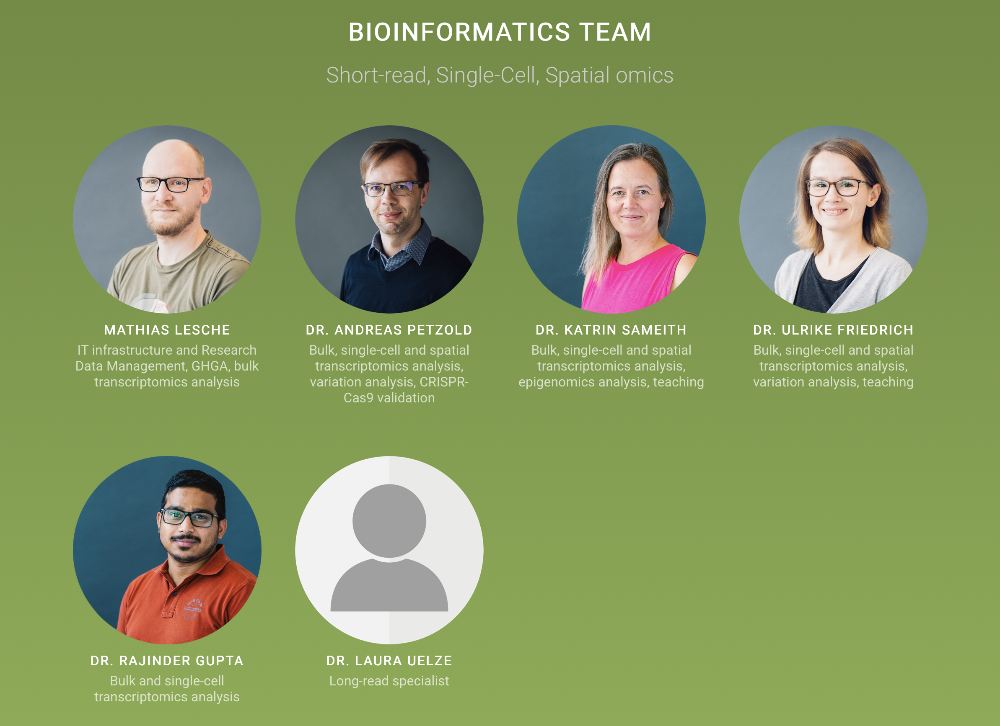
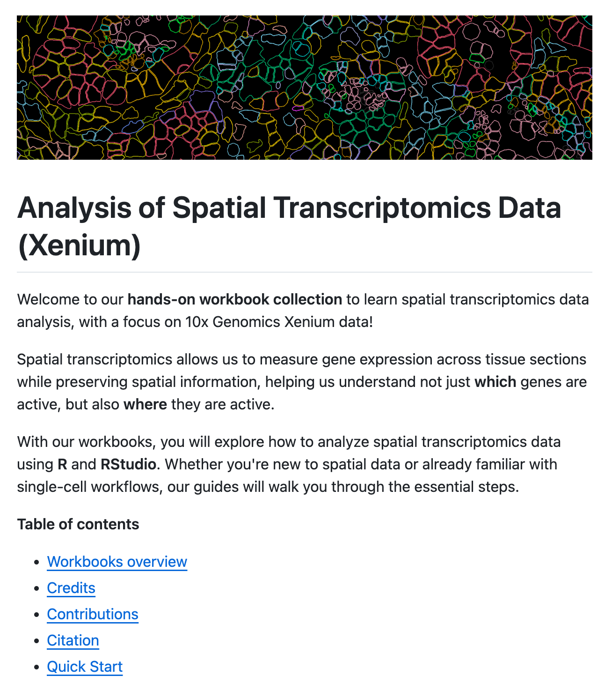
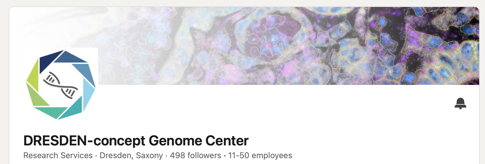
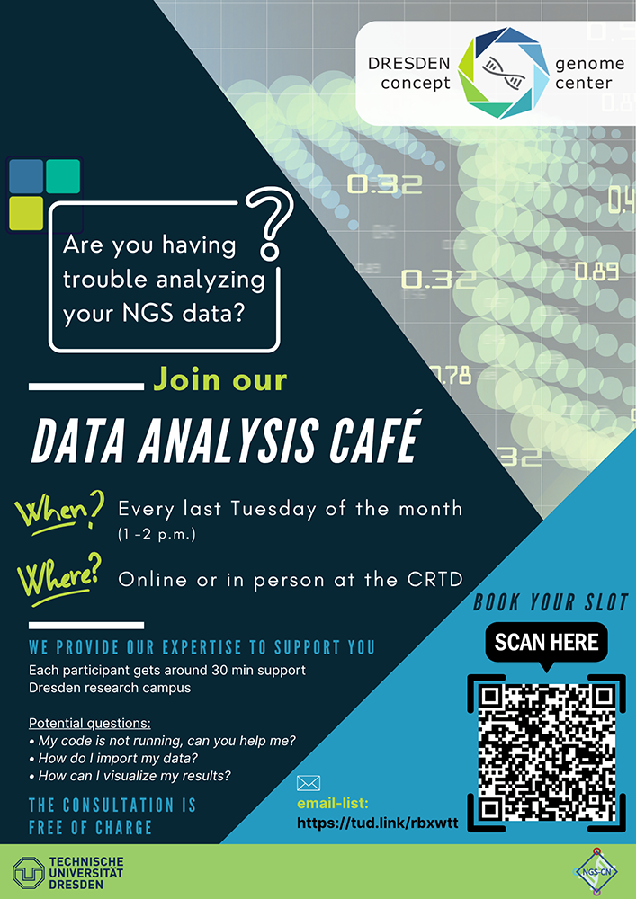
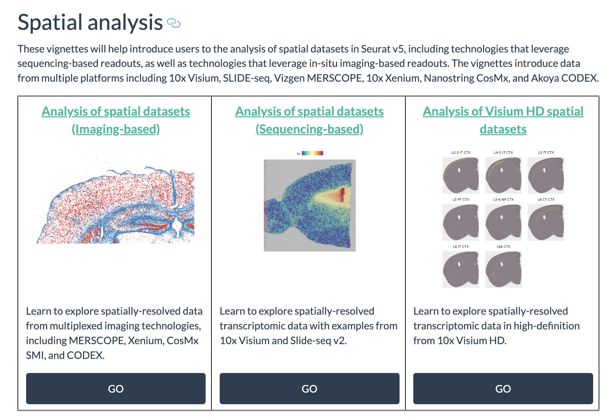
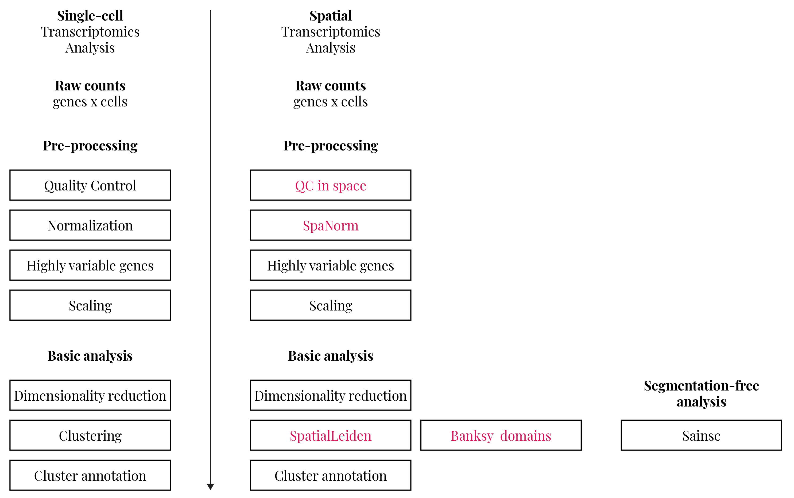

## DcGC Bioinformatics Team 



## Schedule Overview

Today, 20.01.2026 \
11:00 - 12:00 - Set up your computers \
12:00 - 13:00 - Lunch Break \
13:00 - 14:30 - Loading Xenium data into `R` and `Seurat` \
14:30 - 14:50 - Coffee Break \
14:50 - 15:00 - Group Photo \
15:00 - 17:00 - Spatial Transcriptomics Data Analysis \

&nbsp;

Tomorrow, 21.01.2026 \
09:00 - 10:20 - Continuation Data Analysis \
10:20 - 10:40 - Coffee Break \
10:40 - 12:00 - Continuation Data Analysis \

## Code Availability

After the training, you will be able to access all materials via our GitHub repository: \
<https://github.com/dcgc-bfx/spatial-analysis-xenium-training>

:::: {.columns}

::: {.column width="45%"}

:::

::: {.column width="45%"}
&nbsp;

You are welcome to contribute and develop the code further! 
:::

::::

## Netiquette

We prepared code - let us run it in sync with each other \
(do not run your code ahead of the trainer)

&nbsp;

Ask questions - we are here to help you!

## LinkedIn

Follow us on LinkedIn for updates on future trainings and events! \
<https://www.linkedin.com/company/dresden-concept-genome-center/>   
{width=80%}

&nbsp;

<https://www.linkedin.com/in/katrinsameith/> \
<https://www.linkedin.com/in/ulrike-anne-friedrich-7940ab142/> \
<https://www.linkedin.com/in/rajinder-gupta-11512751/> \

## Data Analysis Cafe

Feel free to reach out to us for follow-up questions, and make use of our monthly Data Analysis Cafe: \
{width=35%}

## Literature and toolkits to get started 

Best practices: \
  - Single-cell best practices: <https://www.sc-best-practices.org/preamble.html> \

&nbsp;

Seurat: \
  - Seurat Xenium Analysis Vignette: <https://satijalab.org/seurat/articles/seurat5_spatial_vignette_2> \

&nbsp;

Alternatives to Seurat \
  - Squidpy: <https://squidpy.readthedocs.io/en/stable/> \
  - Giotto: <https://giottosuite.readthedocs.io/en/latest/> \
  
## Seurat vignettes are a good way to get started

 

## Spatial Analysis Overview

 

## Clean-up

- If you would like to keep your copies of the workbook material: \
  - Please copy it now \
  - The files are in your home directory on the HPC cluster \
  - Do not copy the dataset files in the `datasets` directory. Instead, copy only the `download.R` file and use it for download \
  
&nbsp;

- RStudio server jobs will be stopped automatically

## How to use the code later on

All workshop material is available online at: \
<https://github.com/dcgc-bfx/spatial-analysis-xenium-training>

&nbsp;

On a linux machine, you can use our singularity container

```
# Command to download the singularity container
singularity pull oras://gcr.hrz.tu-chemnitz.de/dcgc-bfx/singularity/singularity-single-cell:v1.6.6
```

&nbsp;

On Windows or MacOS, you can install R and RStudio locally and install the required packages

## LinkedIn

Follow us on LinkedIn for updates on future trainings and events! \   
<https://www.linkedin.com/company/dresden-concept-genome-center/>   
{width=80%}

&nbsp;

<https://www.linkedin.com/in/katrinsameith/> \
<https://www.linkedin.com/in/ulrike-anne-friedrich-7940ab142/> \
<https://www.linkedin.com/in/rajinder-gupta-11512751/> \

## Data Analysis Cafe

Feel free to reach out to us for follow-up questions, and make use of our monthly Data Analysis Cafe: \
{width=35%}

